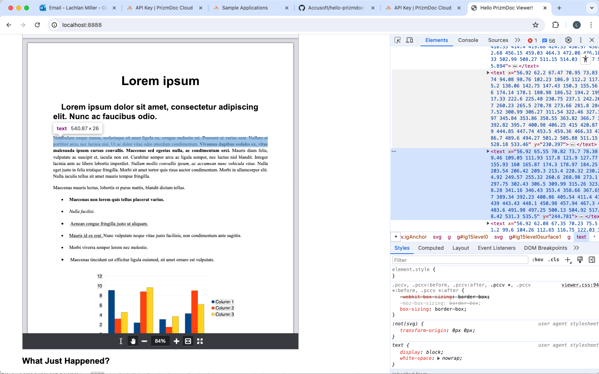

# Doc in Browser Options

Run this demo for online word viewer, shows office viewer.

```py
python3 -m http.server
```

## Actual Word Viewers (this demo)

- Use an `<iframe>`
- Closest to “real”
- Document for URL *must be public* - dealbreaker
- Content uploaded to Google / Microsoft
- It is 1:1 for actual document, good!
- This will be slow if we need to regen the word doc each time.

## Convert to HTML

We can try converting to HTML. There shall be discrepancies. Layouts, etc - basically, things won't look the same.

Editing is possible with caveats, bold/italics/any HTML formatting will prevent any search / replace. Also you need to scroll to the correct page, requires some client side work.

Easily editable, but not 1:1. Anything complex will be a problem (non web native fonts, tables, alignment, columns, anything really, other than basic text). 

The actual doc we deliver (which is what they pay for, their thing, the same but another language) could be different to what they are editing in terms of layout.

## Convert to PDF

Another option, we convert the word doc to PDF, render that. This is closer to 1:1 parity. Need reconvert each time. Similar issues as HTML, but seem less severe.

## Accusoft

This thing just sucks, it converts it to SVG, worse of both worlds. It is truly a viewer, nothing more.

